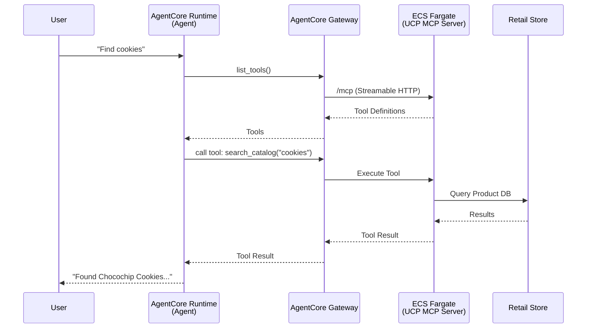

# UCP Shopping Service - MCP Server & AgentCore Integration

This project implements a robust Model Context Protocol (MCP) server for Universal Commerce Protocol (UCP) shopping capabilities. It demonstrates a complete end-to-end architecture: running locally, hosting on AWS ECS with **Streamable HTTP**, and integrating with **Amazon Bedrock AgentCore** via a managed Gateway.

## 🏗️ Architecture

The system enables AI agents to browse catalogs, manage carts, and purchase items through a centralized, secure gateway.



## 🚀 Local Development

### Prerequisites
- Python 3.13+
- `uv` package manager

### Installation
```bash
uv sync
```

### Running Locally
We use a unified entry point [`src/main.py`](src/main.py).

**1. Standard I/O (Stdio)**
Best for local agent testing (e.g., Claude Desktop).
```bash
PYTHONPATH=. uv run python -m src.main --transport stdio
```

**2. Server-Sent Events (SSE)**
Optimized for local development (simplified transport).
```bash
PYTHONPATH=. uv run python -m src.main --transport sse --port 8001
```

---

## ☁️ Cloud Hosting: AWS ECS Infrastructure

The project infrastructure is defined as code (IaC) using **AWS Cloud Development Kit (CDK)** in TypeScript. This ensures reproducible, version-controlled deployments.

### Infrastructure Components
The stack [`infra/lib/infra-stack.ts`](infra/lib/infra-stack.ts) provisions:

1.  **VPC (`AppVpc`)**:
    *   A dedicated network with public subnets and NAT Gateways.
    *   Ensures secure isolation while allowing outbound internet access for image pulls.

2.  **ECS Cluster (`AppCluster`)**:
    *   A Fargate-enabled cluster to manage container execution.
    *   Serverless compute (no EC2 instances to manage).

3.  **Express Gateway Service (`CfnExpressGatewayService`)**:
    *   The core component running our MCP server container.
    *   Handles rolling deployments, health checks (`/`), and auto-scaling (1-3 tasks).

### ⚡ Why ECS Express Mode?
We specifically utilize **Amazon ECS Express Mode** (via `CfnExpressGatewayService`) for this MCP server. This offers distinct advantages over standard Fargate services:

*   **Cost Efficiency**: Express Mode is optimized for high-request volume, spotty traffic patterns typical of agent tool calls, often resulting in lower costs compared to always-on Load Balancers.
*   **Simplicity**: It abstracts away the complexity of configuring Application Load Balancers (ALB), Target Groups, and Listeners. The service exposes a direct public HTTPS endpoint automatically.
*   **Low Latency**: By bypassing traditional heavyweight load balancing infrastructure, it provides faster response times for tool execution.
*   **Instant Scaling**: Designed to scale up and down rapidly in response to agent demand.

### Deployment Steps (CDK)
1. **Navigate to Infra**:
   ```bash
   cd infra
   ```
2. **Deploy**:
   ```bash
   npx cdk deploy
   ```
   *Note: This builds the Docker image, pushes to ECR, and updates the ECS Service.*

**Configuration Details**:
- **Transport**: We use **Streamable HTTP** (`--transport http`) which is stateless and ideal for the load-balanced nature of cloud deployments.
- **Security**: DNS rebinding protection is intentionally disabled in the app to accept traffic from the auto-generated Express Mode domain.

**Output**: You will get a Service URL (e.g., `https://uc-....ecs.us-east-1.on.aws/`).

---

## 🧠 AgentCore Integration

We use **Amazon Bedrock AgentCore** to manage, secure, and deploy the agent workforce.

### 1. Create Gateway
Create a managed gateway to centralize access to your MCP tools.
```bash
agentcore gateway create-mcp-gateway --name ucp-mcp-gateway --region us-east-1
```
*Successfully created Gateway with automated Cognito authorization.*

### 2. Add MCP Target
Connect your ECS-hosted MCP server to the Gateway.
```bash
uv run python agentcore_add_target.py
```
*This script uses the `create_gateway_target` API to register your ECS Service URL.*

### 3. Deploy Agent
We deploy a serverless agent to **AgentCore Runtime**.

**Agent Code**: [`agentcore-mcp/main.py`](agentcore-mcp/main.py)
- Uses `BedrockAgentCoreApp` wrapper.
- Authenticates with the Gateway using Cognito (JWT).
- Uses standard HTTP protocol to communicate as a client.

**Deploy Command**:
```bash
cd agentcore-mcp
agentcore configure --entrypoint main.py --name ucp_agent_mcp --requirements-file requirements.txt --region us-east-1 --protocol HTTP
agentcore launch --auto-update-on-conflict
```

### 4. Invoke Agent
Test the live agent from the CLI:
```bash
agentcore invoke '{"prompt": "retrieve the first 2 products from the catalog"}'
```

---

## ⚠️ Gotchas & Troubleshooting

| Issue | Cause | Solution |
|-------|-------|----------|
| **Invalid Host Header** | ALB sends requests to the ECS task IP/DNS, which FastMCP blocks by default. | We disabled `enable_dns_rebinding_protection` in `src/main.py`. |
| **Connection Closed / Protocol Error** | Traditional SSE connections can be flaky behind Load Balancers with short timeouts. | We migrated to **Streamable HTTP** (`--transport http`) for robust requests. |
| **Agent Return 406 (Not Acceptable)** | Agent configured with `Protocol: MCP` instead of `HTTP`. | Configure agent with `--protocol HTTP` since it acts as a standard client to the Gateway. |
| **Missing Dependencies** | `boto3` or `requests` missing in agent container. | Ensure `requirements.txt` is complete before `agentcore launch`. |

## 📄 API Resources
| Resource | URI | Description |
|----------|-----|-------------|
| **Catalog** | `ucp://catalog/products` | Complete list of products. |
| **Checkout** | `ucp://checkout/{id}` | Live cart state. |

## 📜 License
Copyright 2026 UCP Authors. Licensed under the Apache License, Version 2.0.
