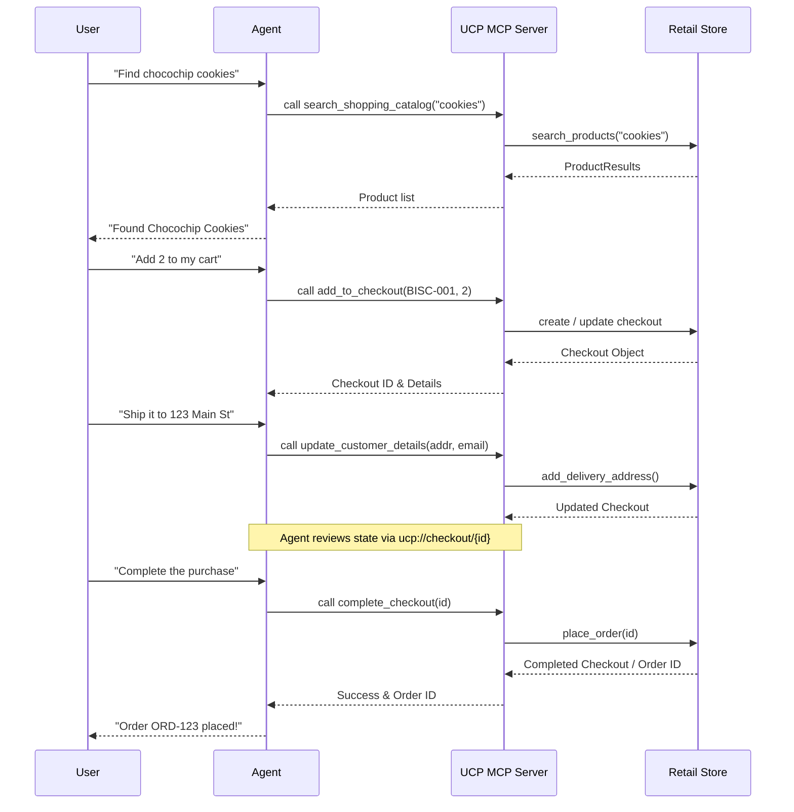

# UCP Shopping Service - MCP Server

A robust Model Context Protocol (MCP) server that provides access to Universal Commerce Protocol (UCP) shopping capabilities. This server enables AI agents to browse catalogs, manage checkouts, and complete purchases using a standardized interface.

## 🏗️ Architecture

The following diagram illustrates the shopping flow implemented by the UCP MCP Server:



## 🛠️ MCP Tools

| Tool Name | Description | Arguments |
|-----------|-------------|-----------|
| `search_shopping_catalog` | Search for products. Returns all if query is empty. | `query` (string) |
| `add_to_checkout` | Adds product to cart. Creates checkout if `checkout_id` missing. | `product_id`, `quantity`, `checkout_id` |
| `remove_from_checkout` | Removes a product from a specific checkout. | `checkout_id`, `product_id` |
| `update_checkout` | Updates item quantity in an existing checkout. | `checkout_id`, `product_id`, `quantity` |
| `get_checkout` | Retrieves the current state of a checkout. | `checkout_id` |
| `start_payment` | Initiates the payment process for a checkout. | `checkout_id` |
| `update_customer_details` | Sets shipping address and buyer email. | `checkout_id`, `address` (dict), `email` |
| `complete_checkout` | Finalizes the checkout and places the order. | `checkout_id` |

## 📄 MCP Resources

| Resource URI | Description |
|--------------|-------------|
| `ucp://catalog/products` | The complete product catalog. |
| `ucp://discovery/profile` | Merchant's UCP capability profile. |
| `ucp://checkout/{checkout_id}` | Live state of a specific checkout session. |
| `ucp://orders/{order_id}` | Order confirmation details for a completed purchase. |

## 💬 MCP Prompts

- **`shopping_assistance`**: A persona-driven prompt that guides the agent on how to use the UCP Shopping Service to help users find and buy products.

## 🚀 Getting Started

### Prerequisites

- Python 3.13+
- `uv` package manager

### Installation

```bash
# Install dependencies
uv sync
```

### Running the Server

**Standard I/O (Stdio):**
```bash
PYTHONPATH=. uv run python -m src.mcp_ucp_server --transport stdio
```

**Server-Sent Events (SSE):**
```bash
PYTHONPATH=. uv run python -m src.mcp_ucp_server --transport sse --port 8001
```

### Running the Demo Client

A polished demonstration script is provided to walk through a complete "happy path" shopping journey:

```bash
# Run stdio demo
PYTHONPATH=. uv run python mcp_ucp_client.py

# Run against a live SSE server
PYTHONPATH=. uv run python mcp_ucp_client.py --transport http --url http://localhost:8001/sse
```

## 🧪 Testing

Run the comprehensive test suite (including end-to-end integration tests):

```bash
PYTHONPATH=. uv run pytest tests/test_mcp_ucp_server.py -v
```

## 📜 License

Copyright 2026 UCP Authors. Licensed under the Apache License, Version 2.0.
